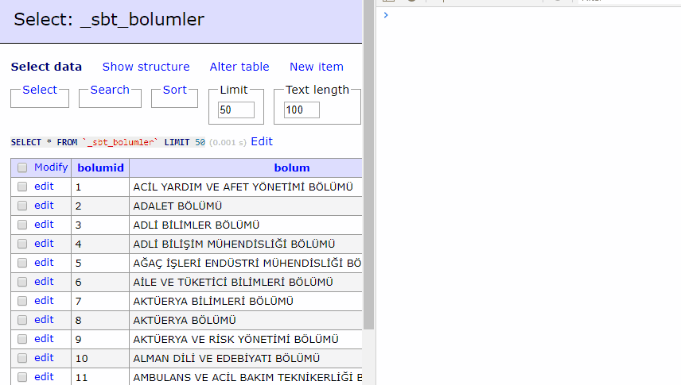

# AdminerCopy
Copy data with right click


# Install
[Detailed Information](https://www.adminer.org/en/plugins/)

Download AdminerCopy.php file to plugins folder in your server. Then paste below code to top of adminer.php file.

Example folder construction:
adminer.php
plugins/
--plugin.php
--AdminerCopy.php

```php
function adminer_object() {
    // required to run any plugin
    include_once "./plugins/plugin.php";
    
    // autoloader
    foreach (glob("plugins/*.php") as $filename) {
        include_once "./$filename";
    }
    
    $plugins = array(
        // specify enabled plugins here
        // other plugins
		    new AdminerCopy,
    );
    
    /* It is possible to combine customization and plugins:
    class AdminerCustomization extends AdminerPlugin {
    }
    return new AdminerCustomization($plugins);
    */
    
    return new AdminerPlugin($plugins);
}

//Adminer file.
```
